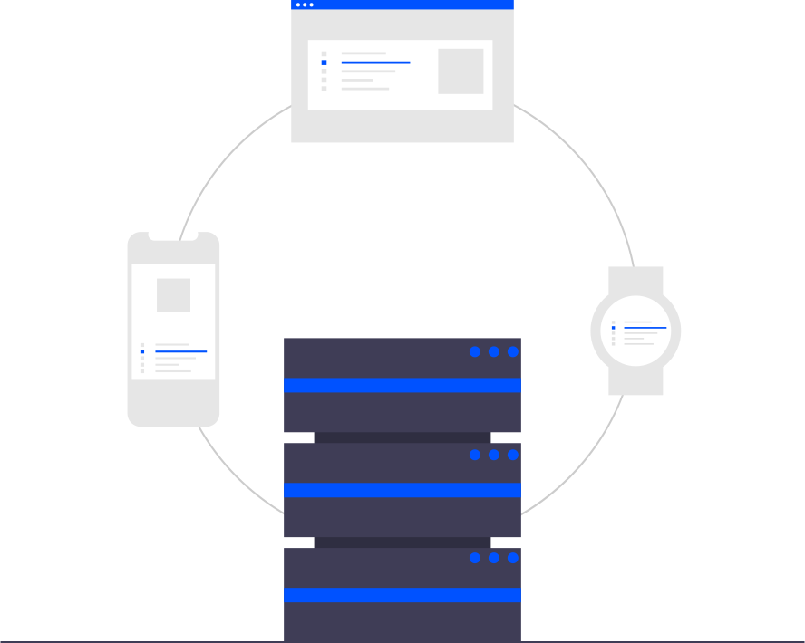
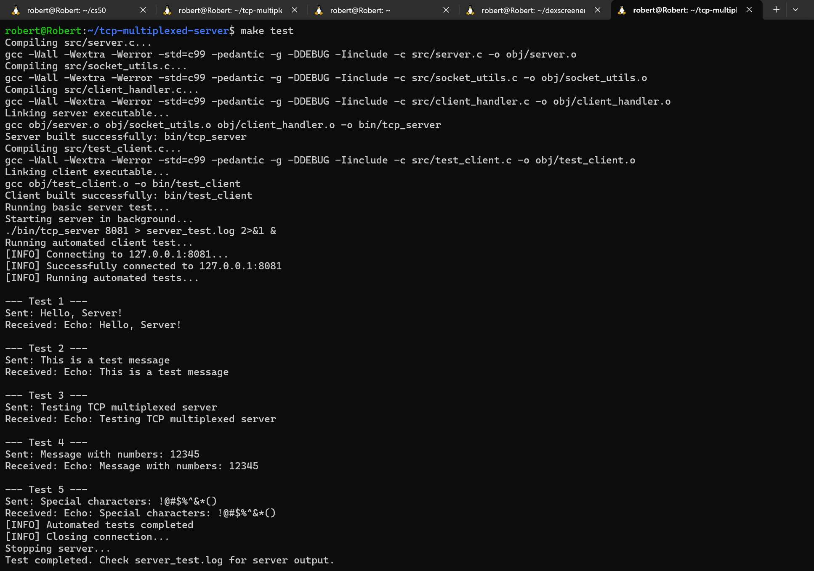
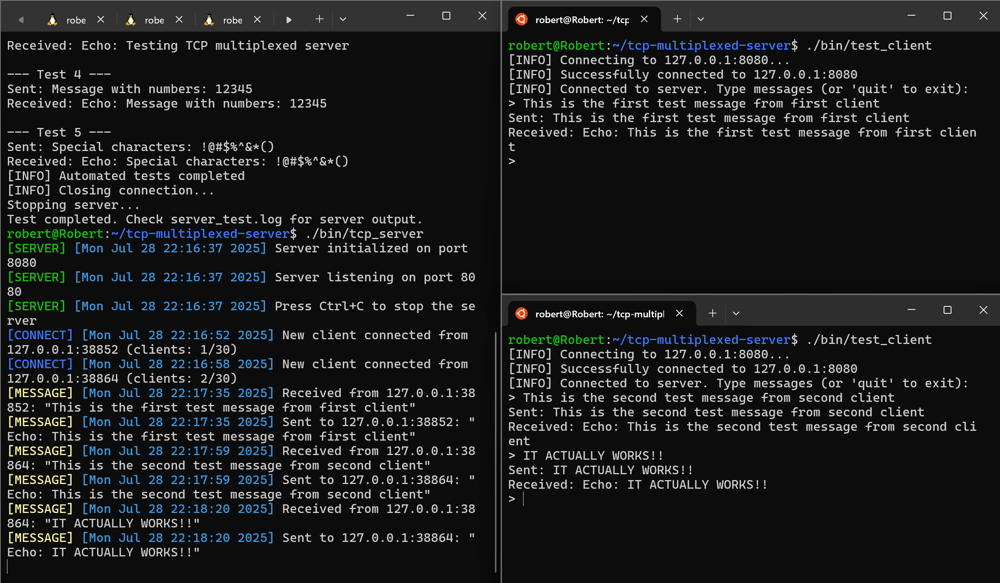

# TCP Multiplexed Server

<div align="center">
  
</div>

This is a TCP server I built for my network programming coursework that handles multiple client connections simultaneously using the select() system call. Instead of creating new processes or threads for each client, it uses I/O multiplexing to manage everything in a single process. The server implements a simple echo service where clients can send messages and receive them back with an "Echo: " prefix.

I wanted to really understand how network servers work under the hood, so I avoided higher-level abstractions and built everything from scratch using standard POSIX socket APIs. The whole thing is written in C99 with strict compiler warnings enabled because I find that catches a lot of subtle bugs early.

## Why I Built It This Way

The assignment required using select() specifically, but even if it didn't, I think this approach has some real advantages. Threading can get messy with shared state and synchronization issues. And forking processes for each client doesn't scale well since you're limited by system resources. With select(), I can handle dozens of clients efficiently in a single process.

My implementation tracks up to 30 concurrent clients in a simple array. I chose this fixed limit because it keeps the code straightforward while still demonstrating the multiplexing concept. In a production system you'd probably want dynamic allocation, but for learning purposes this works well.

The server uses a master file descriptor set to track all active sockets, then copies it to a working set for each select() call. When select() returns, I check which sockets have activity and handle them appropriately. New connections get accepted and added to the client list, while existing clients get their messages read and echoed back.

## Building and Running the project

You'll need GCC and make. The project builds cleanly on Linux systems (I developed it on Ubuntu).

```bash
# Build debug version (default)
make

# Or build optimized release version
make release

# Clean build artifacts
make clean

# Run automated tests
make test
```


_The build system in action - compiling the project and running automated tests_

The build system creates separate executables in the `bin/` directory:

**Start the server:**

```bash
./bin/tcp_server [port]
```

If you don't specify a port, it defaults to 8080. The server will print connection logs with timestamps so you can see what's happening.

**Connect a test client:**

```bash
# Interactive mode - type messages manually
./bin/test_client

# Connect to specific host/port
./bin/test_client -h 192.168.1.100 -p 9090

# Automated testing mode
./bin/test_client -a
```

The test client has both interactive and automated modes where the interactive lets you type messages and see the responses. Automated mode sends a series of test messages which is useful for verifying everything works correctly.


_The server handling multiple simultaneous client connections with colored log output - server logs on the left, two client terminals on the right_

## Implementation Details

The core of the server is a traditional select() loop. I maintain two file descriptor sets - a master set that tracks all active sockets, and a working set that gets passed to select(). This is the standard pattern because select() modifies the fd_set it receives.

```c
while (server->running) {
    server->read_set = server->master_set;  // Copy master to working set

    activity = select(server->max_fd + 1, &server->read_set, NULL, NULL, NULL);

    // Check for new connections on server socket
    if (FD_ISSET(server->server_socket, &server->read_set)) {
        handle_new_connection(server);
    }

    // Check all client sockets for incoming data
    for (i = 0; i < MAX_CLIENTS; i++) {
        if (server->clients[i].active &&
            FD_ISSET(server->clients[i].socket_fd, &server->read_set)) {
            handle_client_message(server, server->clients[i].socket_fd);
        }
    }
}
```

Client management happens through a simple array of client_info_t structures. Each structure tracks the socket file descriptor, client address, and whether the slot is active. When clients disconnect, I clean up their resources and mark the slot as available for reuse.

Error handling was something I spent time getting right. Network programming has lots of edge cases - clients can disconnect unexpectedly, system calls can be interrupted by signals, and you need to handle partial reads/writes. I tried to handle these gracefully without cluttering the main logic too much. The logging system prints timestamped messages so you can track what's happening during operation.

One thing I learned is that signal handling with select() requires some care. I set up handlers for SIGINT and SIGTERM to allow graceful shutdown, but had to account for select() being interrupted by signals. The EINTR check in the main loop handles this properly.

The logging system includes color-coded output that makes it much easier to follow what's happening. Server status messages appear in green, connection events in blue, message traffic in yellow, and errors in red. The colors automatically disable when output is redirected to files or pipes, so it works well in both interactive and automated environments.

## Project Structure

I organized the code into logical modules:

- `src/server.c` - Main server logic and select() loop
- `src/client_handler.c` - Client connection management and message processing
- `src/socket_utils.c` - Socket creation, configuration, and utility functions
- `src/test_client.c` - Test client with interactive and automated modes
- `include/` - Header files with clean interfaces between modules

The Makefile supports both debug and release builds with appropriate compiler flags. Debug builds include symbols and debugging macros, while release builds are optimized. I use strict warning flags (-Wall -Wextra -Werror) because they catch a lot of potential issues.

## Design Trade-offs

The fixed client limit of 30 is somewhat arbitrary. I could have used dynamic allocation to support unlimited clients, but that adds complexity around memory management. For a learning project, the fixed array approach let me focus on the core networking concepts without getting bogged down in resource management details.

I chose to implement echo functionality rather than something more complex because it demonstrates the key concepts - accepting connections, reading data, and writing responses - without additional protocol complexity. The server could easily be extended to support more sophisticated message handling.

The single-process architecture means the server can't take advantage of multiple CPU cores. But given that this is primarily I/O bound work, and the complexity of multi-process coordination, I think the simplicity trade-off is worth it for this use case.

## What I Learned

This project really solidified my understanding of how servers handle multiple clients. Before building this, I understood select() conceptually but hadn't experienced the practical details like file descriptor management and the master/working set pattern.

The trickiest part was getting all the error handling right. Network programming has so many failure modes - clients dropping connections, partial reads, interrupted system calls. I spent a lot of time with the man pages making sure I understood the behavior of each system call.

I also gained appreciation for the importance of good logging. When you're debugging client connection issues, having timestamped logs with client IP addresses makes troubleshooting much easier. The ability to see exactly when clients connect and disconnect was invaluable during development.

Building the test client alongside the server was really helpful. Having automated tests meant I could make changes confidently and verify that everything still worked. The interactive mode was great for manual testing and exploring edge cases.

## Testing

The automated test suite sends several different message types to verify basic functionality:

- Simple text messages
- Messages with numbers
- Messages with special characters
- Multiple rapid-fire messages to test buffering

You can also test manually by running multiple client instances simultaneously to verify the multiplexing works correctly. The server logs show exactly which clients are connected and what messages they're sending.

To test the connection limit, you could write a simple script that opens 35+ connections and verify that the server properly rejects connections beyond its limit.

Working on this project taught me a lot about the practical side of network programming. There are definitely things I'd do differently next time - maybe implement dynamic client allocation or add support for different message types - but it serves its purpose as a solid foundation for understanding how multiplexed servers work.
